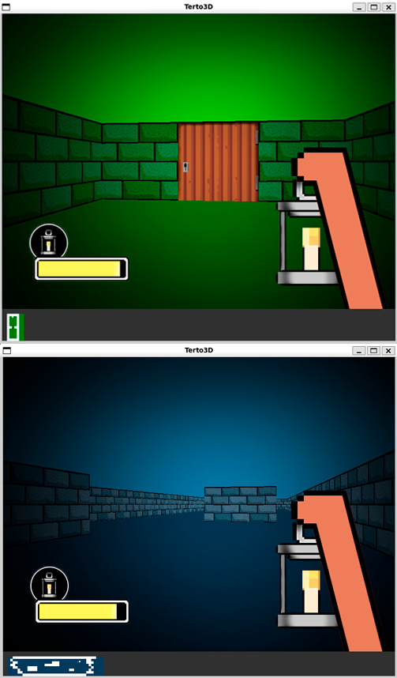

### 🧱 42-Cube3D
Un proyecto de raycasting con motor 3D básico en C utilizando MLX42. Inspirado en Wolfenstein 3D, con animaciones personalizadas, efectos de luz, detección de colisiones y bonus gráficos avanzados.

# 🎮 Features

✅ Raycasting para renderizado 3D  
✅ Movimiento en tiempo real (adelante, atrás, lateral)  
✅ Rotación con el mouse  
✅ Puertas animadas con detección de proximidad  
✅ UI animada con diseño propio  
✅ Efectos de luces con animación personalizada  
✅ Minimap en tiempo real  
✅ Colisiones dinámicas  
✅ Bonus visuales opcionales  
✅ Velocidad de movimiento ajustable (RUN_SPEED activado con 3)  
✅ Soporte para mapas .cub  


# 📸 Screenshots


# Bonus Destacados
Animaciones de interfaz (UI) y luces, diseñadas en base a sprites propios.
Puertas animadas, con transición de apertura/cierre en tiempo real.
Rotación con ratón, oculta el cursor automáticamente al iniciar.

Teclas de debug:
1 activa/desactiva colisiones.
2 reinicia animaciones de luz.
3 alterna entre caminar/correr.
4 fuerza la vista con el ratón (Solo en linux)


# 🛠️ Instalación de Dependencias (Ubuntu / WSL)
```bash
make winstall
```

# 🔧 Instalación de MLX42
```bash
make libs
```

# 🎮 Controles
Tecla	Acción
W / ↑	Moverse hacia adelante
S / ↓	Moverse hacia atrás
A   	Moverse hacia la izquierda (lateral)
D	    Moverse hacia la derecha (lateral)
←       Rotación izquierda
→       Rotación derecha
1	    Activar/desactivar colisiones con paredes (solid_walls)
2	    Recargar la animación de luz de la linterna
3	    Alternar entre caminar (MOVE_SPEED) y correr (RUN_SPEED)
ESC	    Salir del juego

# Compilación de mapas válidos
```bash
make
./cube3d map1.cub
```

```bash
make
./cube3d map2.cub
```

```bash
make
./cube3d map3.cub
```

```bash
make
./cube3d map4.cub
```

```bash
make
./cube3d map5.cub
```

# ✅ Estado
Proyecto aprobado y validado en 42 Network ✅  
Comprobado con Valgrind y Sanitizer  
Sin memory leaks propios  
Listo para clonar y ejecutar en Linux / WSL  